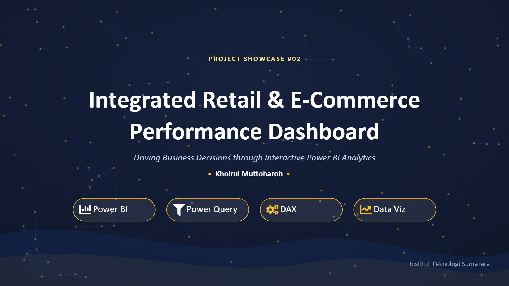
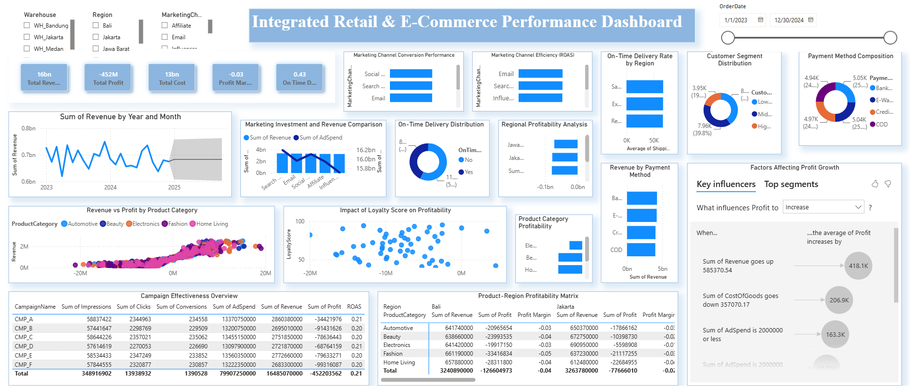
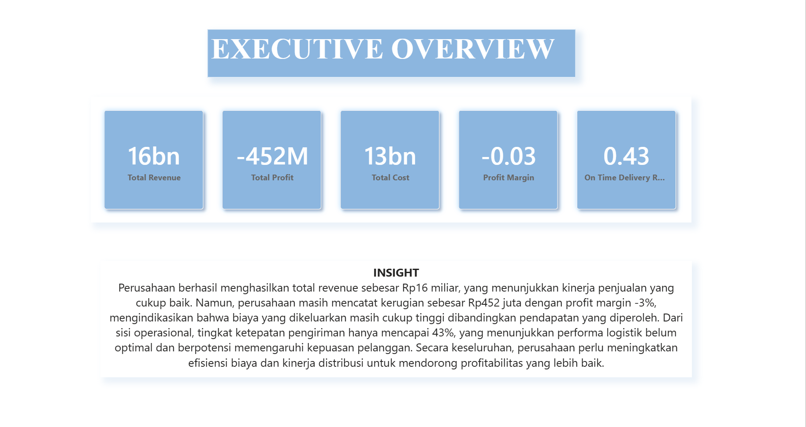
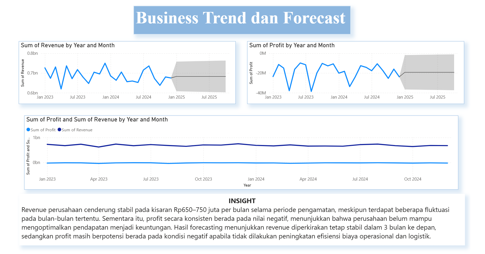
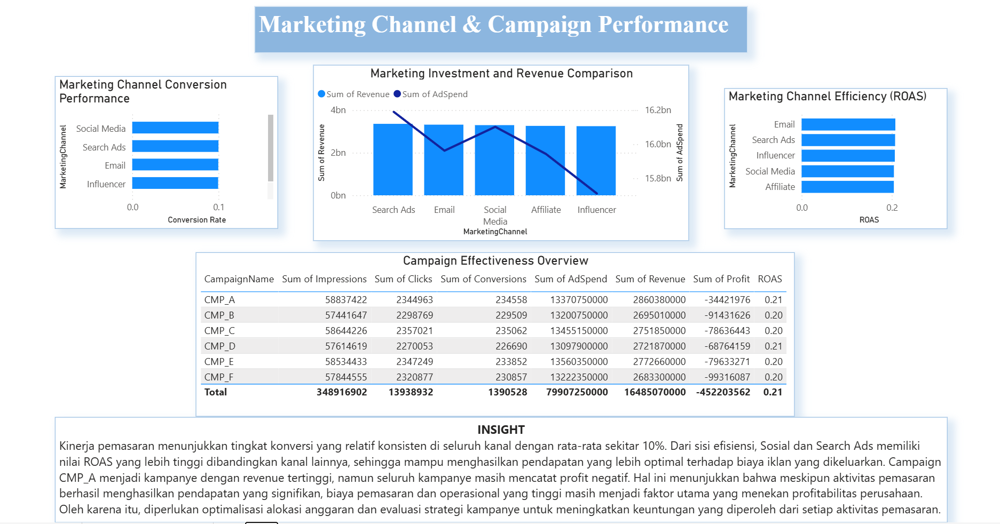
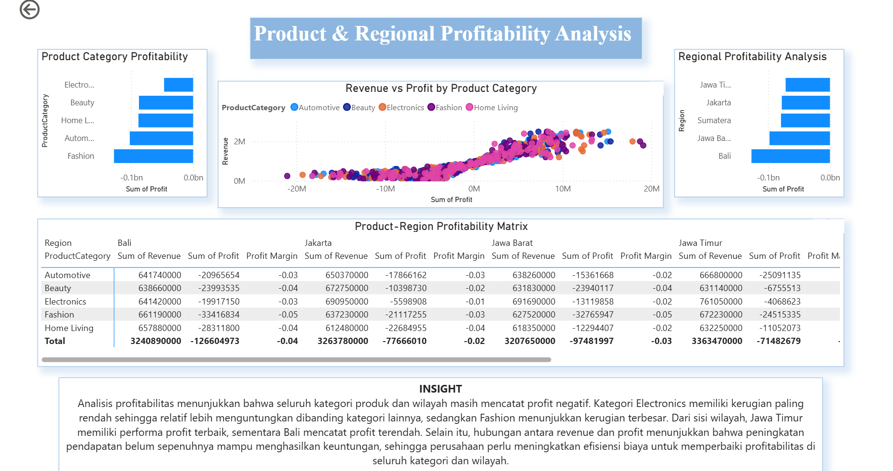
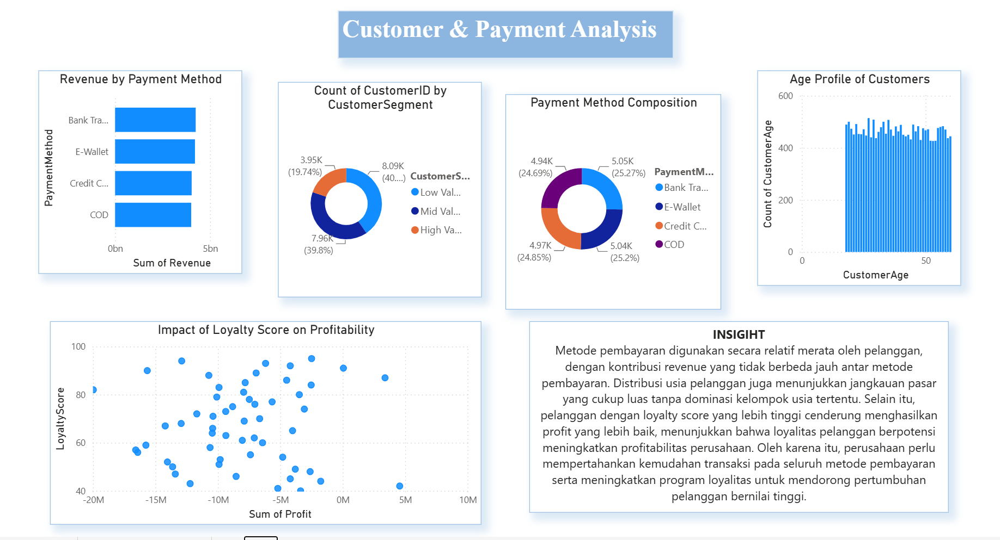
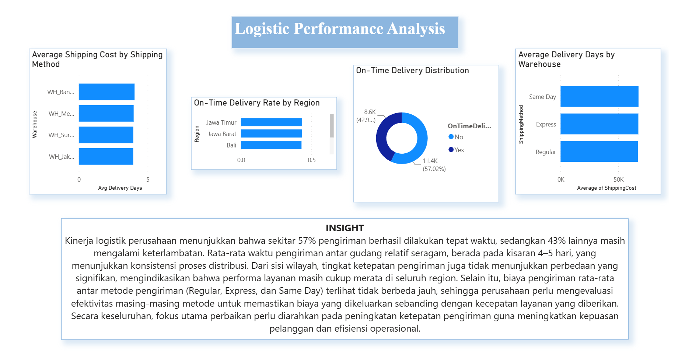
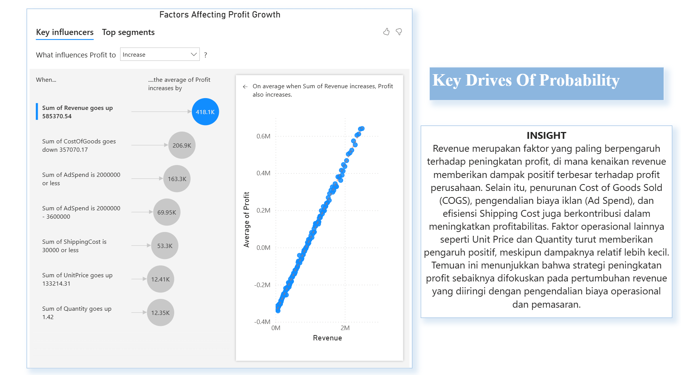

# 📊 Integrated Retail & E-Commerce Performance Dashboard

<p align="center">
  
</p>

<p align="center">


</p>

---

# 📖 Overview

This project presents an **Integrated Retail & E-Commerce Performance Dashboard** developed using **Power BI** to monitor and evaluate business performance across multiple operational areas.

The dashboard combines sales, marketing, logistics, product, and customer data into a centralized analytical platform that supports data-driven decision making through interactive visualizations and business insights.

---

# 🎯 Business Problem

Retail and e-commerce companies generate large volumes of business data every day.

However, business managers often face several challenges:

- Difficulty monitoring sales performance from multiple reports
- Measuring marketing effectiveness
- Evaluating logistics performance
- Understanding product profitability
- Monitoring customer behavior

Therefore, an integrated dashboard is needed to support faster and more accurate business decisions.

---

# 🎯 Project Objectives

- Monitor overall business performance
- Analyze revenue, profit, and operational costs
- Evaluate marketing campaign effectiveness
- Analyze logistics performance
- Monitor product profitability
- Understand customer behavior
- Generate actionable business insights

---

# 📂 Dataset

| Item | Description |
|------|-------------|
| Domain | Retail & E-Commerce |
| Period | 2023–2024 |
| Dashboard Tool | Power BI |
| Data Processing | Power Query |
| Data Modeling | DAX |

---

# 🛠️ Tech Stack

- 📊 Power BI
- ⚡ DAX
- 🔄 Power Query
- 📈 Excel

---

# 📷 Dashboard Preview

## Executive Dashboard

<p align="center">

</p>

---

# 📌 Dashboard Features

✔ Executive Overview

✔ Business Trend & Forecast

✔ Marketing Performance

✔ Logistics Performance

✔ Product Profitability

✔ Customer Analysis

✔ Key Influencer Analysis

---

# 📊 Dashboard Pages

## Executive Overview



---

## Business Trend & Forecast



---

## Marketing Performance



---

## Logistics Performance



---

## Product & Regional Profitability



---

## Customer Analysis



---

## Key Influencer Analysis



---

# 📈 Key Insights

- Revenue reached approximately **Rp16 Billion**
- Company recorded **Rp452 Million loss**
- Profit Margin remained negative (-3%)
- On-Time Delivery reached only 43%
- Revenue is the strongest factor influencing profitability
- Marketing campaigns generate high revenue but operational costs remain high

---

# 💡 Business Recommendations

- Improve logistics efficiency
- Reduce operational costs
- Optimize marketing budget allocation
- Increase customer loyalty programs
- Prioritize high-margin products
- Improve delivery performance

---

# 📁 Repository Structure

```text
integrated-retail-ecommerce-dashboard/
│
├── dashboard/
│     └── Dashboard.pbix
│
├── data/
│
├── images/
│
├── reports/
│
├── docs/
│
└── README.md
```

---

# 📲 Interactive Dashboard

👉 **Power BI Dashboard**

Scan the QR Code below to explore the interactive dashboard.

<p align="center">

</p>

Or click:

**🔗 Power BI Dashboard**

https://your-powerbi-link

---

# 👨‍💻 Author

**Khoirul Muttoharoh**

Data Science Student

Institut Teknologi Sumatera

📧 Email : your-email

💼 LinkedIn : https://linkedin.com/in/khoirul-muttoharoh-057a54277

🐙 GitHub : https://github.com/khoirulmuttoharoh

---

## ⭐ If you found this project useful, don't forget to leave a star!
